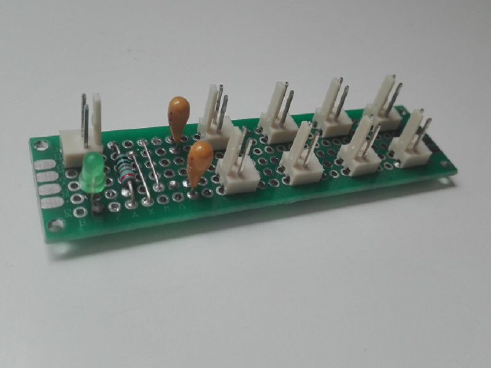
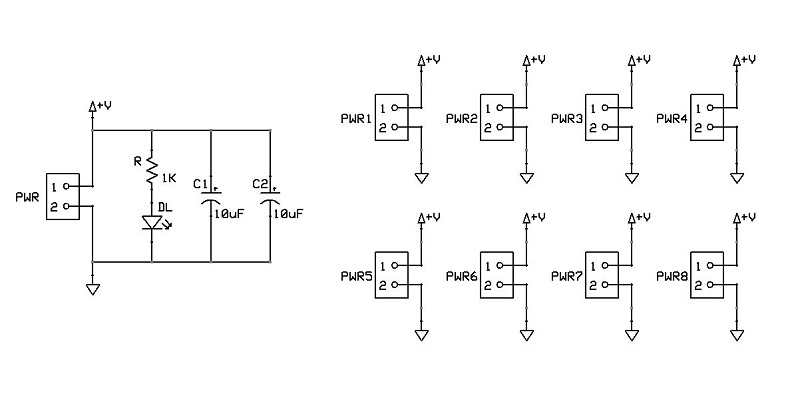
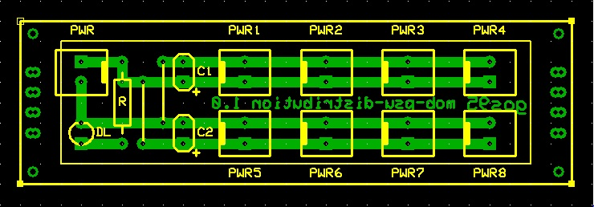

# *PSU Distribution* Module Board
8-lines power bus expansion module board.
 
In most cases you will need to connect more than one MOB to the power supply at the same time, so you will need more power connectors. 
This is precisely the function of this module.
This MOB can operate at both 3V3 and 5V.

## Schematic

## PCB Layout

## Bill of Materials
- [x] paperboard 2x8cm
- [x] 9 x 2-pin (Molex-KK) power connectors
- [x] 2 x bulk capacitors (tantalum) 10uF 16V
- [x] led current limiter resistor 1Kohm
- [x] power activity led green 3mm