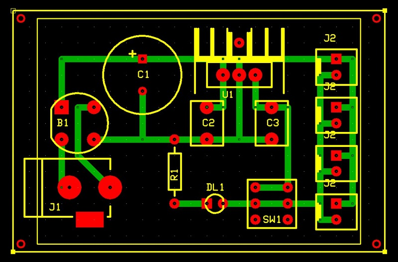

# Scheda funzione di alimentazione schede
E' il modulo che fornisce la tensione stabilizzata +5V necessaria al funzionamento di tutte le schede.
Funziona con un qualunque alimentatore esterno la cui tensione di uscita sia compresa tra +9V a +12V, stabilizzati o meno, e fornisce in uscita +5v stabilizzati, ed una corrente massima di circa 200mA.

## Schema elettrico

## PCB

## Materiale occorrente
- [x] paperboard millefori 4x6cm
- [x] connettore di alimentazione 5.1mm
- [x] resistenza di limitazione corrente LED 1Kohm
- [x] LED verde per stato on/off
- [x] condensatore elettrolitico 1000uF 50V
- [x] 2x condensatori 0.1uF 50V
- [x] ponte di diodi da 1A
- [x] regolatore di tensione tipo 7805 in package TO220
- [x] interruttore microswitch mono o bi-polare per on/off
- [x] 4x 2-pin connettore tipo Molex-KK o KF2510