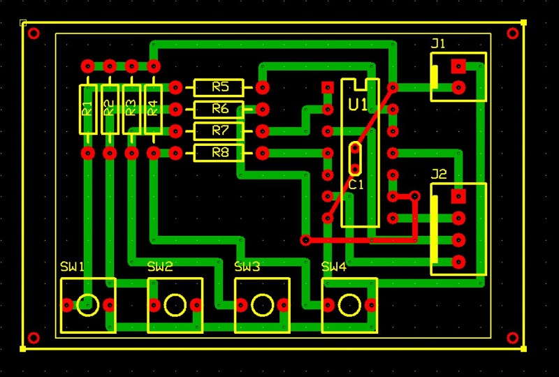

# Scheda funzione generatore linee logiche momentanee
Modulo per generare 4 linee logiche momentanee, ossia attive solo mentre sono premuti i corrispondenti switch di attivazione, contrassegnati con: SW1, SW2, SW3, SW4. 
Gli switch attivano ognuno una linea dati logica, contrassegnata a seconda dello switch a cui fa riferimento con: D1, D2, D3, D4. 
Le linee possono trovarsi in uno dei due stati:
- livello logico basso: ossia ad una tensione di 0V, che si indica con "0" logico o "L";
- livello logico alto: ossia ad una tensione di +5V, che si indica con "1" logico o "H".

La scheda è progettata con logica "active-low", in modo tale che quando uno switch è premuto (SW=ON), il livello della relativa linea della scheda è basso:

    SWn = OFF -> Dn = H
    SWn = ON  -> Dn = L

## Schema elettrico

## PCB

## Materiale occorrente
- [x] paperboard doppia-faccia 4x6cm
- [x] 4x pulsanti microswitch SPST (normalmente aperti)
- [x] 4x resistenze di pull-up 47Kohm
- [x] 4x resistenze di pull-down 100ohm
- [x] IC 74LS00 Quadruple 2-input negative-and gate
- [x] condensatore 100nF
- [x] 2-pin connettore alimentazione scheda tipo Molex-KK o KF2510 2P
- [x] 4-pin connettore linee dati tipo Molex-KK o KF2510 4P