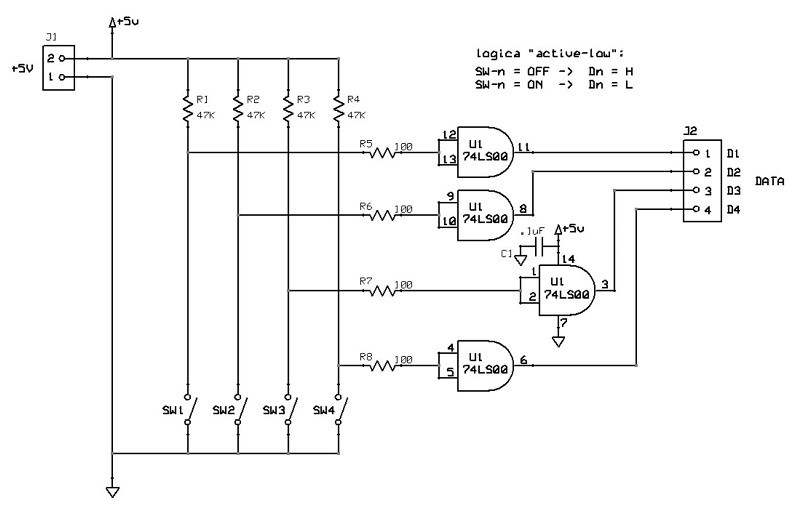

# Scheda funzione 4 linee logiche permanenti
Modulo per generare 4 linee logiche permanenti mediante l'utilizzo di interruttori di attivazione/disattivazione, contrassegnati con: SW1, SW2, SW3, SW4. 
Gli switch attivano ognuno una linea dati digitale, contrassegnata a seconda dello switch a cui fa riferimento con: D1, D2, D3, D4. 
Le linee possono trovarsi in uno dei due stati:
- livello basso: ossia ad una tensione di 0V, che si indica con "0" logico o "L";
- livello alto: ossia ad una tensione di +5V, che si indica con "1" logico o "H".

La scheda è progettata con logica "active-low", in modo tale che quando uno interruttore è ON, il livello della relativa linea della scheda è basso:

    SWn = OFF -> Dn = H
    SWn = ON  -> Dn = L

## Schema elettrico

## PCB

## Materiale occorrente
- [x] paperboard doppia-faccia 5x7cm ritagliato a 3x6cm
- [x] 4x interruttori microswitch SPST (on/off)
- [x] 4x resistenze di pull-up 47Kohm
- [x] 4x resistenze di pull-down 100ohm
- [x] IC 74LS00 Quadruple 2-input negative-and gate
- [x] condensatore 100nF
- [x] 2-pin jumper maschio per alimentazione scheda
- [x] 4-pin jumper maschio per uscite dati digitali