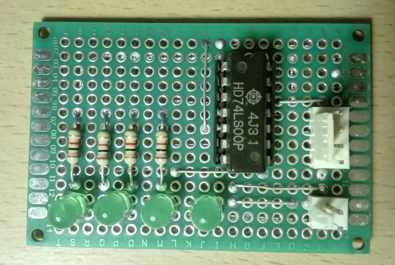
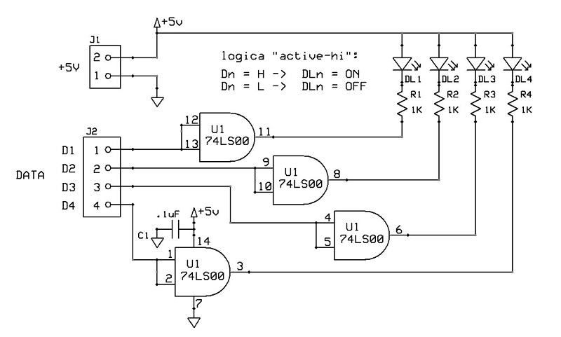
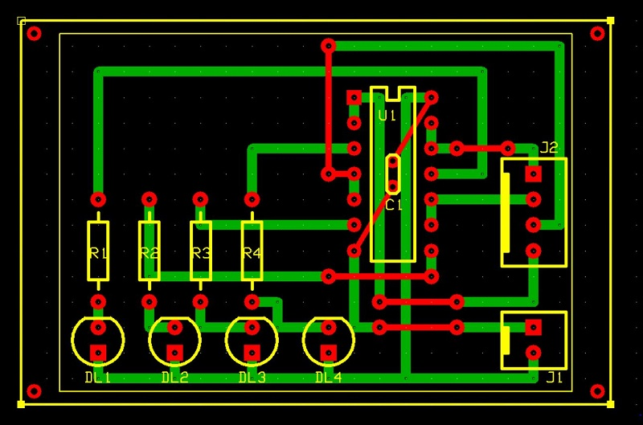

# Scheda funzione indicatore a LED di livello logico linee
Modulo indicatore di livello logico di 4 linee tramite LED.

## Schema elettrico

## PCB

## Materiale occorrente
- [x] paperboard doppia-faccia 4x6cm
- [x] 4x resistenze 1Kohm
- [x] 4x LED verdi
- [x] IC 74LS00 Quadruple 2-input negative-and gate
- [x] condensatore 100nF
- [x] 2-pin connettore alimentazione scheda tipo Molex-KK o KF2510 2P
- [x] 4-pin connettore linee dati tipo Molex-KK o KF2510 4P