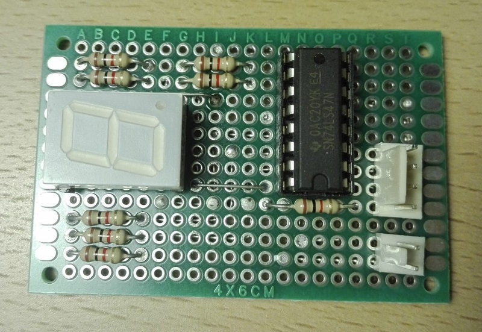
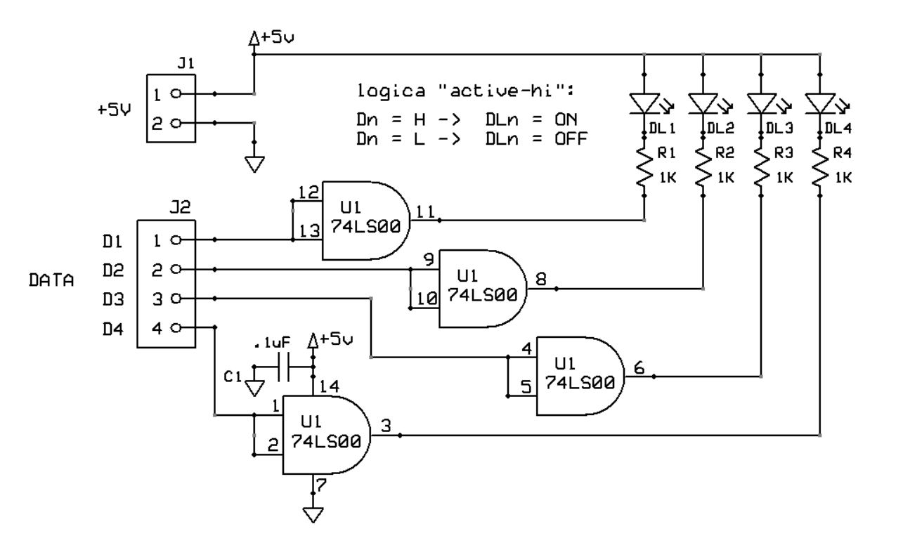
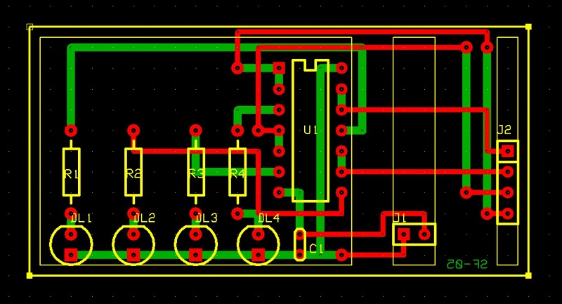

# Scheda funzione 4 indicatori di livello linea a LED
Modulo indicatore di livello logico di 4 linee tramite LED.

## Schema elettrico

## PCB

## Materiale occorrente
- [x] paperboard doppia-faccia 5x7cm ritagliato a 3x6cm
- [x] 4x resistenze 1Kohm
- [x] condensatore 100nF
- [x] IC 74LS00 BCD to 7-Segment Decoder/Driver
- [x] 4x LED
- [x] 2-pin jumper maschio per alimentazione scheda
- [x] 4-pin jumper maschio per ingresso dati digitali