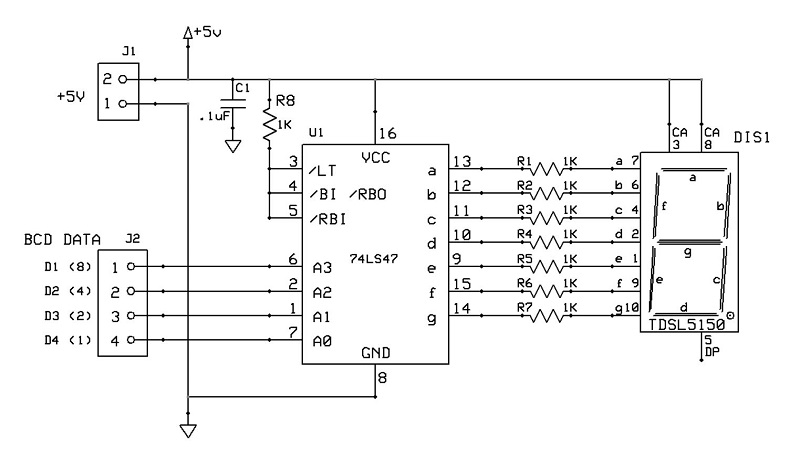
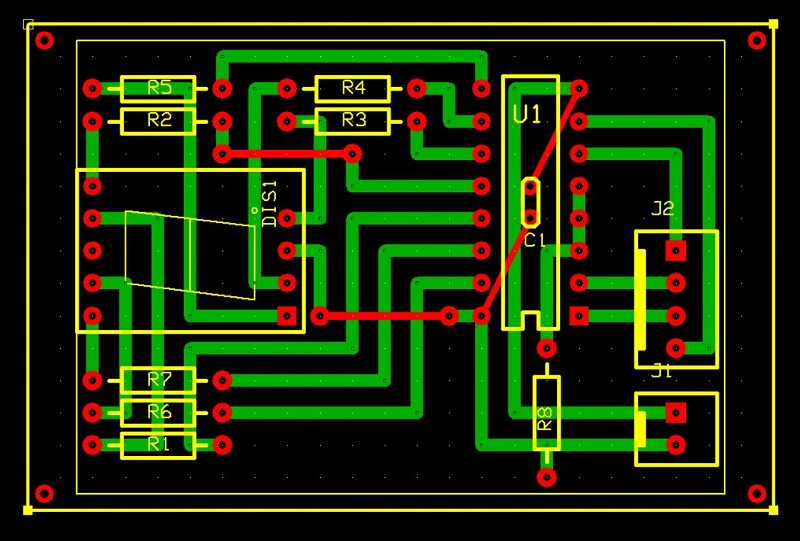

# Scheda funzione display 7-segmenti
Modulo con ingresso binario BCD che pilota un display 7-segmenti ad una cifra.

## Schema elettrico

## PCB

## Materiale occorrente
- [x] paperboard 4x6cm
- [x] 8x resistenze 1Kohm
- [x] display 7-Segmenti ad anodo comune TDSL5150
- [x] IC 74LS47 BCD to 7-Segment Decoder/Driver
- [x] condensatore 100nF
- [x] 2-pin connettore alimentazione scheda tipo Molex-KK o KF2510 2P
- [x] 4-pin connettore linee dati tipo Molex-KK o KF2510 4P