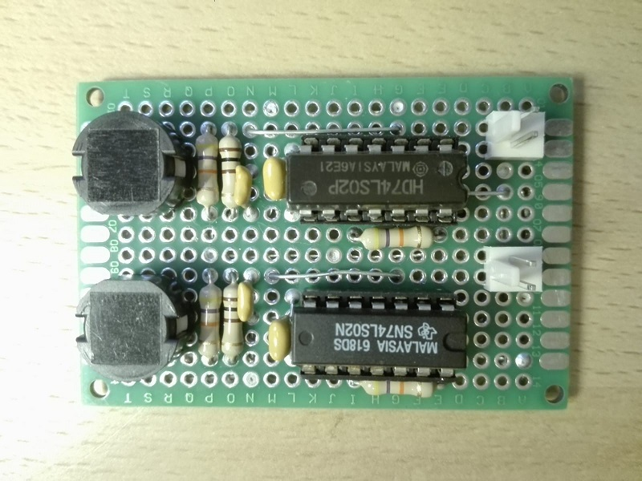

# Scheda funzione generatore di impulsi
Modulo per generare impulsi logici singoli tramite switch.
L'impulso inizia alla pressione dello switch e termina circa 15ms dopo, a prescindere dallo stato in cui si trova lo switch (se ancora premuto o rilasciato).
La durata di 15ms dell'impulso è un tempo sufficientemente lungo da assorbire eventuali contatti spuri dello switch durante la sua pressione,
ma anche non troppo lungo da essere percepito come un ritardo quando viene premuto velocemente più volte lo switch.

La scheda è progettata con logica "active-low", in modo tale che l'uscita è sempre a livello alto, tranne quando l'impulso è attivo, periodo in cui si trova a livello basso.

## Schema elettrico

## PCB

## Materiale occorrente
- [x] paperboard 4x6cm
- [x] 2x pulsanti microswitch SPST (normalmente aperti)
- [x] 2x resistenze di pull-up 47Kohm
- [x] 2x resistenze di pull-up 22Kohm
- [x] 2x resistenze di pull-down 100ohm
- [x] 2x IC 74LS02 Quadruple 2-input negative-or gate
- [x] 4 x condensatori 100nF
- [x] 2 x condensatori 1uF
- [x] 2 x 2-pin connettore scheda tipo Molex-KK o KF2510 2P