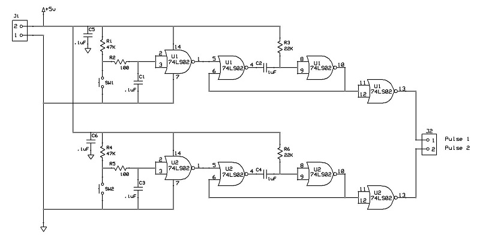

# Scheda funzione display 7-segmenti
Modulo con ingresso binario BCD che pilota un display 7-segmenti ad una cifra.

## Schema elettrico

## PCB

## Materiale occorrente
- [x] paperboard doppia-faccia 5x7cm ritagliato a 3x6cm
- [x] 8x resistenze 1Kohm
- [x] condensatore 100nF
- [x] IC 74LS47 BCD to 7-Segment Decoder/Driver
- [x] display 7-Segmenti TDSL5150
- [x] 2-pin jumper maschio per alimentazione scheda
- [x] 4-pin jumper maschio per ingresso dati digitali