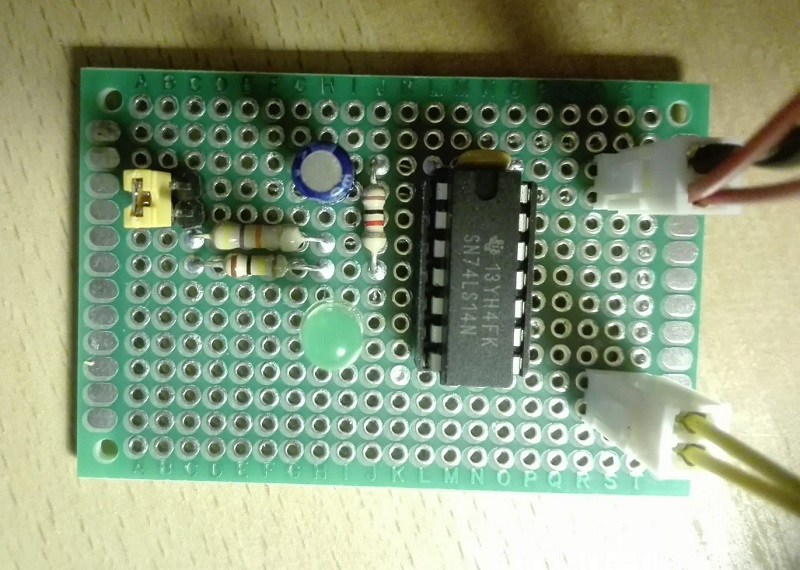
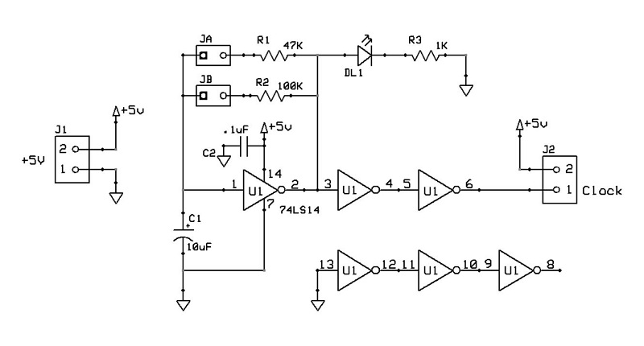
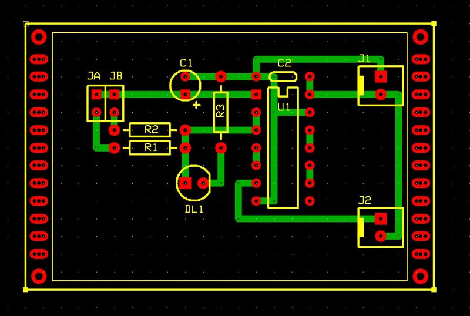

# Scheda funzione generatore di clock
Modulo generatore di segnale periodico, di frequenza selezionabile, tramite jumper, tra circa 1Hz e circa .5Hz.

## Schema elettrico

## PCB

## Materiale occorrente
- [x] paperboard 4x6cm
- [x] resistenza 1Kohm, 47Kohm e 100Kohm
- [x] LED verde
- [x] IC 74LS14 Hex Schmitt-Trigger Inverters
- [x] condensatore 100nF, 10uF
- [x] 2x 2-pin jumper connector
- [x] 2x 2-pin connettore pcb tipo Molex-KK o KF2510 2P