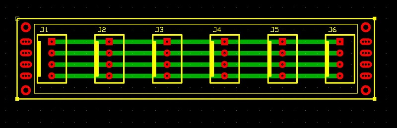

# Scheda funzione distrubuzione di linee dati
Modulo di distribuzione delle linee dati.

## Schema elettrico

## PCB

## Materiale occorrente
- [x] paperboard doppia-faccia 2x8cm
- [x] 6x 4-pin connettore linee dati tipo Molex-KK o KF2510 4P