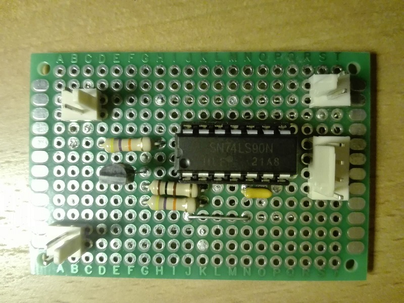
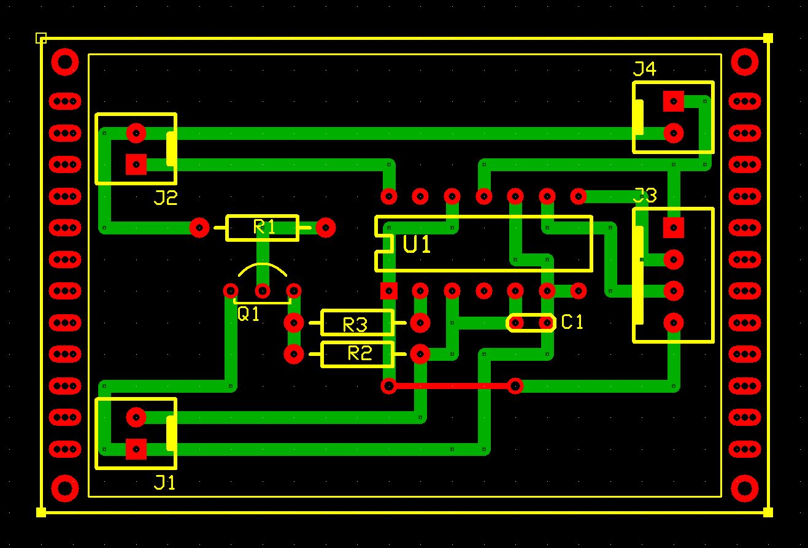

# Scheda funzione contatore modulo 10
Modulo contatore decimale di impulsi di clock in ingresso.
Il conteggio viene presentato in formato BCD sulla linea dati di uscita. E' presente un ingresso di reset, attivo basso, che azzera il conteggio.

Per permettere il collegamento in cascata di più contatori, e quindi riuscire a contare con più cifre decimali,
in uscita viene riportata una linea di controllo costituita dai segnali: 
- riporto o carry: attivo sul fronte di discesa, che indica che il contatore è arrivato a contare 10
- reset: lo stesso segnale che arriva in ingresso propagato al modulo successivo

La scheda è progettata per ricevere impulsi (di clock e reset) con logica "active-low", quindi segnali sempre a livello alto, tranne quando l'impulso è attivo, periodo in cui si presentano a livello basso.

## Schema elettrico

## PCB

## Materiale occorrente
- [x] paperboard 4x6cm
- [x] resistenza di polarizzazione 100ohm
- [x] 2x resistenze di polarizzazione 47Kohm
- [x] transistor generico NPN
- [x] IC 74LS90 Decade counter
- [x] condensatori 100nF
- [x] 3 x 2-pin connettore scheda tipo Molex-KK o KF2510 2P
- [x] 4-pin connettore linee dati tipo Molex-KK o KF2510 2P